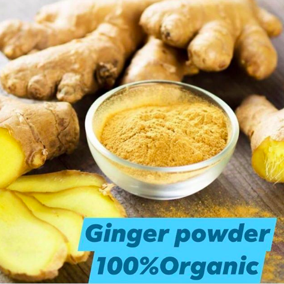
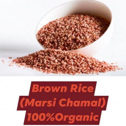
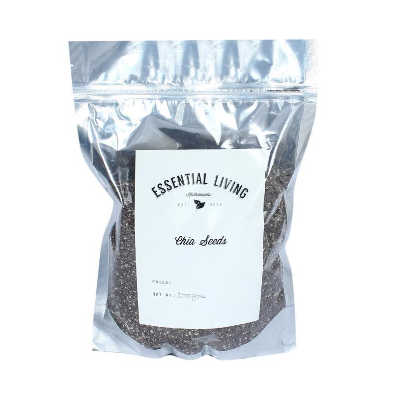
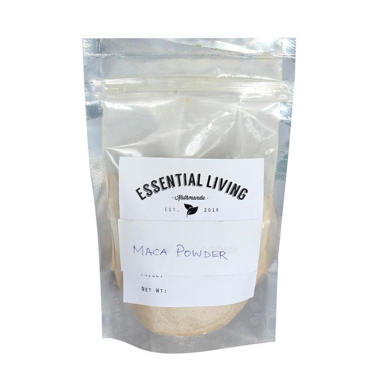
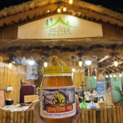

# Organic Shop Nepal - Complete Products Catalog

Full catalog from [Organic Shop Nepal](https://organicshopnepal.com/shop-now/). Products with local images available. Prices in Nepalese Rupees (₨).

## Product Details

| Product Name                                 | Price                             | Description                                                                                                                                | Product Link                                                                                                                                                                                                               | Image Link                                                |
| -------------------------------------------- | --------------------------------- | ------------------------------------------------------------------------------------------------------------------------------------------ | -------------------------------------------------------------------------------------------------------------------------------------------------------------------------------------------------------------------------- | --------------------------------------------------------- |
| Red Taichin Millet – रातो ताइचिन चिउरा – 1kg | ₨ 220.00                          | Nutrient-rich, high-fiber millet locally produced to support Nepali farmers. Ideal for khichdi, traditional dishes, or healthy breakfasts. | [View Product](https://organicshopnepal.com/product/red-taichin-millet-%e0%a4%b0%e0%a4%be%e0%a4%a4%e0%a5%8b-%e0%a4%a4%e0%a4%be%e0%a4%87%e0%a4%9a%e0%a4%bf%e0%a4%a8-%e0%a4%9a%e0%a4%bf%e0%a4%89%e0%a4%b0%e0%a4%be-1kg/)     |  |
| Special Ghee – गाउँघर स्पेशल घ्यू – 1 kg     | ₨ 1,200.00                        | Aromatic ghee from local milk, supporting Nepali farmers. Perfect for cooking or traditional dishes.                                       | [View Product](https://organicshopnepal.com/product/special-ghee-%e0%a4%97%e0%a4%be%e0%a4%89%e0%a4%81%e0%a4%98%e0%a4%b0-%e0%a4%b8%e0%a5%8d%e0%a4%aa%e0%a5%87%e0%a4%b6%e0%a4%b2-%e0%a4%98%e0%a5%8d%e0%a4%af%e0%a5%82-1-kg/) |        |
| Ginger Powder                                | ₨ 1,600.00 (Sale from ₨ 1,850.00) | Bold, spicy powder rich in antioxidants for digestion and immunity support.                                                                | [View Product](https://organicshopnepal.com/product/ginger-powder-100-organic/)                                                                                                                                            |       |
| Brown Rice – Marsi Chamal                    | ₨ 320.00 (Sale from ₨ 350.00)     | Premium Himalayan brown rice with nutty flavor, high in fiber and nutrients for sustained energy.                                          | [View Product](https://organicshopnepal.com/product/brown-rice-pure-marsi-chamal/)                                                                                                                                         |  |
| Chia Seeds                                   | ₨ 500.00                          | Nutritional powerhouse with omega-3s, fiber, and protein for heart health and digestion.                                                   | [View Product](https://organicshopnepal.com/product/buy-chia-seeds-in-nepal/)                                                                                                                                              |          |
| Maca Root Powder                             | ₨ 3,000.00 (200g)                 | Energizing superfood for hormonal balance and energy, rich in vitamins and minerals.                                                       | [View Product](https://organicshopnepal.com/product/buy-maca-powder-in-nepal/)                                                                                                                                             |         |
| Organic Honey – Raw & Unprocessed – 500g     | ₨ 650.00                          | Pure Himalayan honey full of enzymes and antioxidants, ideal for natural remedies.                                                         | [View Product](https://organicshopnepal.com/product/organic-honey-raw-unprocessed/)                                                                                                                                        |       |
